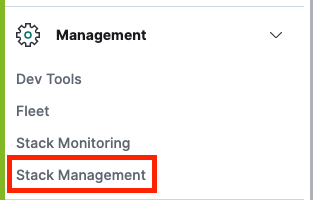
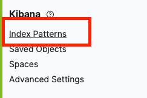
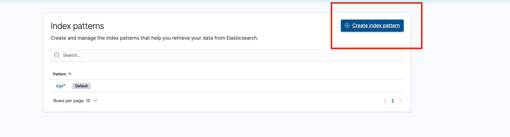

# Structured Logging

This project has two components.
First one is elk stack. The other is example microservice.

### How to run elk stack

You can run it by `docker-compose up -d`. 


If you want to check elk logs, you run this command `docker logs elk_<elasticsearch or kibana or logstash>_1 -f`.

```
input {
	tcp {
        port => 5000
	}
}

filter {
	json {
		source => "message"
	}
}

output {
	elasticsearch {
		hosts => ["elasticsearch:9200"]
		index => "ega"
	}
}

```
Logstash listens 5000 port and parse message from microservice. And then, It sends message(log) to elasticsearch `ega` index.

To see logs on kibana, you have to create index.







### Service

```
...
    <Appenders>
        <Socket name="logstash-tcp" host="127.0.0.1" port="5000" protocol="TCP">
            <JsonLayout compact="true" eventEol="true" properties="true" stacktraceAsString="true">
            </JsonLayout>
        </Socket>
    </Appenders>
...
```

`JsonLayout` Appends a series of JSON events as strings serialized as bytes.


In this `Appenders` you open a tcp socket on port 5000.

`compact`
It takes a boolean type value, i.e. true or false. The default value for this property is false. 
When we set this property to true, 
then no new line character is added at the end of the JSON log string and no indentation is done, 
due to which the log will appear as one single line.


`eventEol`
This property is used to add an end-of-line character, which is \r\n characters after each log event. 
This property takes a boolean value and the default value is false.
We can use this property with value set as true and `compact=true` to get one record per line, 
which will make the JSON logs more readable.


`properties`
Log4j2 supports slf4j MDC along with its own Thread content map. 
To show this map value in the log events, we can set this property with name properties as true, 
and you will get an additional field with name contextMap added to your JSON logs, 
which will have the entire MDC Map dumped in it.


```
@Override
public boolean preHandle(HttpServletRequest request, HttpServletResponse response, Object object) {
    UUID requestId = UUID.randomUUID();
    MDC.put("userId", request.getHeader("userId"));
    MDC.put("requestId", requestId.toString());
    return true;
}
```

While implementing microservices, the best practice to add information to the MDC is in the Interceptor Layer. 
This is the single place where the call to service passes through.

The example listed below implements a HandlerInterceptor interface. 
In the overridden method,preHandle, 
it reads from the HTTP request header, userId and requestId  and adds it to the MDC.

